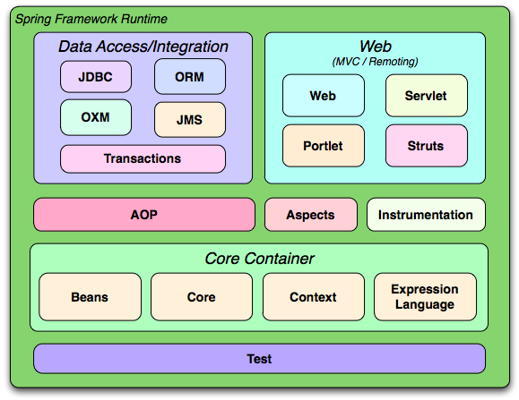

# Spring的架构

Spring框架是一个分层架构，由定义良好的模块组成，你可以只使用其中某一些模块。下面我们从总体上介绍所有的模块构成。

Spring框架根据开发需要，提供了约20个模块。这些模块又可以归纳成几个类别：核心容器层(Core Container)，数据访问集成层(Data Access/Integration)，Web层， AOP(Aspect Oriented Programming)， Aspects， Instrumentation和Test模块。

## 核心容器层(Core Container)

核心容器包含有Core、Beans、Context和Expression Language模块。

- Core模块：框架的基础部分，提供IoC(反转控制)和依赖注入特性。
- Beans模块：其中的`BeanFactory`实现了经典的Factory模式。
- Context模块：构建于Core和Beans模块基础之上，可以通过Context来获得任何对象的引用。`ApplicationContext`是Context模块中最常被用到的一个接口。
- Expression Language模块：Expression Language模块提供了一个强大的表达式语言用于在运行时查询和操纵对象。

## 数据访问集成层(Data Access/Integration)

数据访问集成层包含有JDBC、ORM、OXM、JMS和Transaction模块。

- JDBC模块：该模块提供了一个JDBC抽象层，你不再需要编写繁琐的JDBC代码，不再需要处理数据库厂商特有的错误代码。
- ORM模块：该模块为流行的`对象-关系映射`(ORM, Object - Relational Mapping)API提供了一个交互层，这些ORM API包括JPA、JDO、Hibernate、iBatis等。
- OXM模块：该模块提供了一个对Object/XML映射实现的抽象层，Object/XML映射实现包括JAXB、Castor、XMLBeans、JiBX和XStream。
- JMS模块：该模块主要包含了消息生产和消息消费等消息机制。
- Transaction模块：该模块支持编程式和声明式的事务管理，事务管理机制对于实现了特定接口的类和所有的POJO都适用。

## Web层

Web层包含了Web、Web-Servlet、Web-Struts、Web-Porlet模块。

- Web模块：该模块提供了基本的面向web的特性：例如多文件上传、使用servlet listeners初始化IoC容器以及一个面向web的application context。它还包含Spring远程支持中与web相关部分。
- Web-Servlet模块：该模块包含Spring的MVC（Model-View-Controller）实现。
- Web-Struts模块：该模块提供了对Struts集成的支持。注意，该支持在Spring 3.0中已经deprecated了，所以需要考虑将应用转换成Struts+Spring集成或者Spring MVC了。
- Web-Portlet模块：该模块提供了用于portlet环境下的MVC实现，它其实是Web-Servlet模块的复制。

## AOP, Aspects, Instrumentation模块

- AOP模块：该模块提供了面向切片编程的实现，它可以让你定义方法拦截器和切点，从而降低了功能代码之间的耦合度。
- Aspects模块：该模块提供对AspectJ集成的支持。AspectJ是另外一个强大而成熟的面向切面编程框架。
- Instrumentation模块：该模块提供了对类的instrumentation的支持和classloader实现，使得可以在特定的应用服务器上使用。

## Test模块

- Test模块:该模块支持使用测试框架JUnit和TestNG对Spring组件进行测试。
