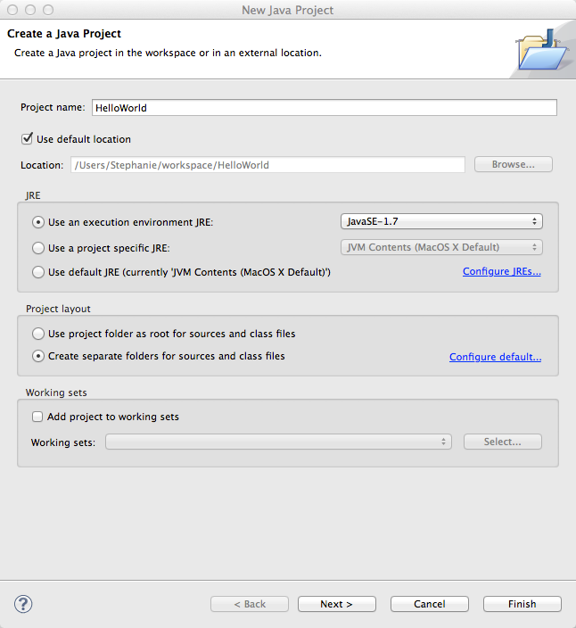
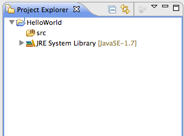
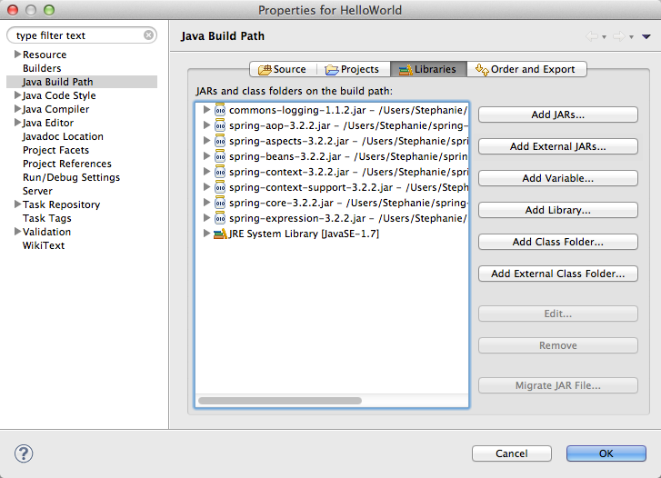
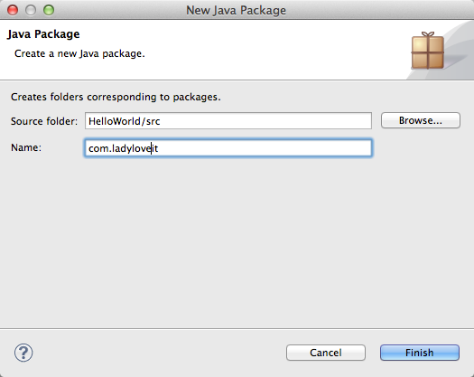

# 第一个HelloWorld程序

让我们用Spring来写第一个应用程序吧。

完成这一章要求：

- 熟悉Java语言
- 设置好Spring的环境
- 熟悉简单的Eclipse IDE的操作

如果你还没有设置好环境，请参考[Spring开发环境的配置](http://www.ladyloveit.com/spring/spring-development-environment-configuration/)。

我们第一个程序是打印"Hello World"语句，这个语句通过Spring的配置文件来设置。

## 1 - 新建Java项目：

第一步用Eclipse IDE新建一个项目。 点击 `> File > New > Java Project`。然后在弹出的对话框中输入项目的名称，我们就叫`HelloWorld`吧。这会在你的workspace下新建一个HelloWorld的目录作为项目的根目录。

点击`Finish`。你会在`Project Explorer`视图看到新建的项目。如果`Project Explorer`没有打开，请在`> Window > Show View`中找到。

## 2 - 添加Spring库

接下来要加入必要的Spring库添加到CLASSPATH下，以便Eclipse编译和运行程序时能够找到所需要的class。

右键在`Package Explorer`中点击`> Build Path > Configure Build Path...`。然后点击`Add External JARs...`加入我们需要的Spring库。如果还没有下载Spring库，请先[下载Spring库](http://www.ladyloveit.com/spring/spring-development-environment-configuration/#spring)。

我们需要加入的Spring库有：

- org.springframework.aop-3.2.2
- org.springframework.aspects-3.2.2
- org.springframework.beans-3.2.2
- org.springframework.context-3.2.2
- org.springframework.context.support-3.2.2
- org.springframework.core-3.2.2
- org.springframework.expression-3.2.2

此外，为了打印信息，我们还需要一个Apache Commons Logging API，在这里[下载commons-logging-1.1.x](http://commons.apache.org/proper/commons-logging/download_logging.cgi)。本教程写作的时候，最新版是commons-logging-1.1.2。下载后解压缩到任意目录，我解压到`~/commons-logging-1.1.2`。

然后和添加Spring库一样添加commons-logging-1.1.2.jar到CLASSPATH中。

## 3 - Java源代码

首先新建一个包“com.ladyloveit”。右键点击src，然后`> New > Package`，新建`com.ladyloveit`包。

然后我们需要在`com.ladyloveit`包下新建两个Java源文件`HelloWorld.java`和`MainApp.java`。

HelloWorld.java:

<pre class="brush: java; gutter: true">
package com.ladyloveit;

public class HelloWorld {

	private String message;

	public void setMessage(String message){
		this.message  = message;
	}

	public String getMessage(){
		return this.message;
	}

	public void printMessage(){
		System.out.println("Your Message : " + message);
	}
}
</pre>

MainApp.java:

<pre class="brush: java; gutter: true">
package com.ladyloveit;

import org.springframework.context.ApplicationContext;
import org.springframework.context.support.ClassPathXmlApplicationContext;

public class MainApp {
	public static void main(String[] args) {

		ApplicationContext context = new ClassPathXmlApplicationContext("Beans.xml");

		HelloWorld obj = (HelloWorld) context.getBean("helloWorld");

		obj.printMessage();
	}
}
</pre>

## 4 - 配置文件

接下来，我们需要新建一个XML文件来配置bean，这个XML的作用是集中在一个地方，配置和管理所有的bean。有关bean的概念，请看[Bean的定义](http://www.ladyloveit.com/spring/spring-bean-definition/)。

我们将这个XML文件也放在`src`下面，这样就保证Eclipse可以在CLASSPATH下读取到这个文件。

新建一个`Beans.xml`，当然这个文件名任意，不过要和MainApp.java中`ApplicationContext context = new ClassPathXmlApplicationContext("Beans.xml")`设置的一致。

Beans.xml

	<?xml version="1.0" encoding="UTF-8"?>

	<beans xmlns="http://www.springframework.org/schema/beans"
	    xmlns:xsi="http://www.w3.org/2001/XMLSchema-instance"
	    xsi:schemaLocation="http://www.springframework.org/schema/beans
	    http://www.springframework.org/schema/beans/spring-beans-3.0.xsd">

	   <bean id="helloWorld" class="com.ladyloveit.HelloWorld">
	       <property name="message" value="Hello World!"/>
	   </bean>

	</beans>

这个Beans.xml文件中设置了bean，包含在`<beans>`和`</beans>`中。每个bean都有一个唯一的id。

	<property name="message" value="Hello World!"/>

这个语句为`message`变量赋值，这样就能打印出`Hello World!`了。要修改输出，只需要修改XML文件，而不需要修改MainApp.java和HelloWorld.java。

## 5 - 运行程序

当你完成了以上的步骤，我们便可以运行程序了。

右键MainApp.java，点击`> Run As > Java Application`。也可以在工具栏找到运行按钮。

如果一切正常，输出如下：

<pre>
Your Message : Hello World!
</pre>

## 回顾运作流程

1. 首先会运行main()语句，Spring框架使用`ClassPathXmlApplicationContext()`首先创建一个容器。
2. 这个容器从`Beans.xml`中读取配置信息，并根据配置信息来创建bean(也就是对象)，每个bean有唯一的id。
3. 然后通过`context.getBean()`找到这个id的bean，获取对象的引用。
4. 通过对象的引用调用`printMessage()`方法来打印信息。

好了，这是你的第一个Spring应用。你已经学会用Eclipse新建Java项目，导入Spring和commons-logging库，编写Java源代码和XML配置文件，并且成功运行了。如果要更改输出，只需要修改XML文件<property>中的value值，而不需要更改Java源文件。

下面的章节，我们将会在这个基础上体验Spring更多更强大的功能。

